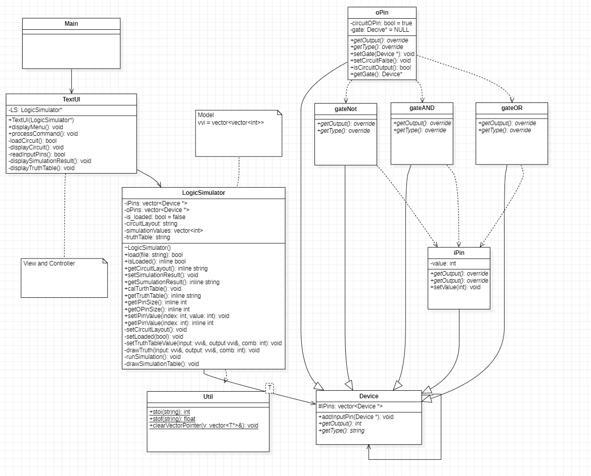

## Tool
* CMake
* make (linux) and msbuild (windows)
* GNU compiler
* UML Class Diagram (MVC)

## C++
* Memory management (vector of pointer)
* Class relation
* Template header
* File (fstream)

## Class Diagram

  

* **Virtual and Override** - Following the convention, I denote pure virtual functions using italic font. Since there is no standard convention for denoting overridden functions, I also use italic font and add the label `overrided` at the return position of the function.   
* **Inheritance** - The convention suggests that inherited functions in the derived class should be written with a `different color`. However, due to limitations in my IDE's font color customization, I made the decision to not include the inherited functions in my derived class (which may not be ideal).

## Reference
* [Why can templates only be implemented in the header file?](https://stackoverflow.com/questions/495021/why-can-templates-only-be-implemented-in-the-header-file?noredirect=1&lq=1)
* [C++ 讀檔，讀取txt文字檔各種範例 | ShengYu Talk](https://shengyu7697.github.io/cpp-read-text-file/)
* [UML Class Diagram Explained With C++ samples | CPP Code Tips](https://cppcodetips.wordpress.com/2013/12/23/uml-class-diagram-explained-with-c-samples/)
* [UML relationships - dashed line vs solid line](https://stackoverflow.com/questions/26982886/uml-relationships-dashed-line-vs-solid-line)
* [[物件導向 Ep. 2] 三大特性](https://codimd.mcl.math.ncu.edu.tw/s/E15d-0xtp)
* [C++ 設計模式：MVC模式](https://www.twblogs.net/a/5e958430bd9eee3420903dd0)
